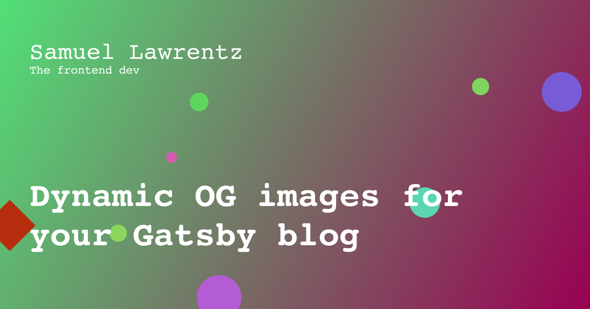

So this website is built using [GatsbyJS](https://www.gatsbyjs.com/), which is super cool and super easy to get started. It took just one week for me to set this all up. This is the 6th blog post here on this website and if you try sharing this blog post on the internet you would see a image with the title. This image is called the OG image.

## What is an OG image?
Open Graph Images is a simple way to add images to your posts. An open graph image or OG image is the image that appears when you post a link to a web page or video content on your social media sites. This forms part of an important group of meta tags that directly impact how the content links perform on social media platforms. 

<Banner>Try sharing this link on twitter or linkedin, you would find the OG being rendered.</Banner>

## GatsbyJS and OG images
Gatsby ecosystem is growing everyday and new plugins popup every day. There are few plugins which creates OG images from HTML/JSX content. These plugins use [`pupeteer`](https://pptr.dev/) to load that HTML content and then it takes a screenshot of the page and then saves it as a `.png`. It is a quite awesome plugin. 

### Pupeteer
`pupeteer` is nothing but a Chrome browser that runs headlessly and there are options to integrate the live chrome browser as well. The issue with this thing is that, it takes `~280mb` to run and I'm personally a person who doesn't like apps or bundles that takes a lot of space. Eventhough `pupeteer` is a dev dependency, I wanted a simple solution to generate my OG images.

## The solution
After doing some intensive google searches, I figured out there is actually another way to create OG images - **The canvas way**. Why to use a heavy package as `pupeteer` when you just want a canvas that can be exported as a PNG image. Then I came across this package called `node-canvas` which does the same thing as HTML canvas but it does it in nodeJS, so that you don't need to fire up a browser inorder to screenshot your page. 



The above image was generated using the following code and its the OG image for this blog.

### Integrating [`node-canvas`](https://github.com/Automattic/node-canvas) into the Gatsby Ecosystem
It is time to implement our idea. This is where the concept of `plugins` come into picture. 

#### Gatsby Plugins
Gatsby has almost 3000 plugins for each of your requirement be it meta tags, RSS feeds, image optimization, etc. These plugins tap into your website content/data and then create assets or does stuff that you want to before build, post build, etc. 

#### The plugin
A local plugin can be created by creating a folder with package.json in it. The code goes into the `gatsby-node.js` file.

```js
// plugins/gatsby-node.js
const canvas = require('../../canvas.js')
const fs = require('fs')
const path = require('path')
exports.createPages = async ({ actions, graphql }) => {
	const folderpath = './public/og-images'
	if (!fs.existsSync(folderpath)) 
          fs.mkdirSync(path.resolve(folderpath))
	const result = await graphql(`{{query}}`)

 if (result.errors) {
	console.error(errors)
	return console.error({ ...result.errors })
	}

	const posts = result.data.allMdx.nodes

	for (const node of posts) {
	canvas.gen(node.frontmatter.title, node.id)
	}
}
```
This code is nothing but a simple graphQL query which returns you the list of posts and then renders an OF image using the title of each post.

## The Canvas

Canvas is a very fun thing to work in the HTML world. Canvas is pretty useful to do paint related stuff in browser. Thanks to `node-canvas` we now have the capablity to play with canvas even on `node` environments.

The code for generating canvas can be found below. You can play with the canvas. This is the code that generates my OG images on the fly.

```js
// canvas.js
const { createCanvas, loadImage } = require('canvas')
const fs = require('fs')
const path = require('path')
// Size for the OG image
const canvas = createCanvas(1200, 630)
const ctx = canvas.getContext('2d')

let drawCircle = function (x, y, d) {
  // Draw circle
};


exports.gen = function gen(title, id) {


  // Linear Gradient
  var grd = ctx.createLinearGradient(0, 0, 1200, 630);
  grd.addColorStop(0, 'hsl(' + 360 * Math.random() + ',70%,60%)');
  grd.addColorStop(1, 'hsl(' + 360 * Math.random() + ',100%,30%)');
  ctx.fillStyle = grd;
  ctx.fillRect(0, 0, 1200, 630);
  const noOfSircles = Math.ceil(Math.random() * 7)
  const noOfRect = Math.ceil(Math.random() * 7)
  // Set fontstyle
  ctx.font = '900 70px Courier';
  ctx.fillStyle = 'white';
  d
  // call helper method to get number of lines
  const lines = getLines(ctx, title, 1080)
  lines.forEach((line, i) => ctx.fillText(line, 60, 580 - (80 * (lines.length - i))))
  // Set fontstyle
  ctx.font = '48px Courier';
  ctx.fillText('{{Author Name}}', 60, 120)
  ctx.font = '100 24px Courier';
  ctx.fillText('{{slogan}}', 60, 150)

  const buffer = canvas.toBuffer('image/png')
  console.info('Generating for', id)
  // write as .png
  fs.writeFileSync(path.resolve(`./public/og-images/${id}.png`), buffer)
}

```

That is how the OG image for this blog is getting generated. Hope you liked this post. Stay tuned for more.

❤️❤️❤️