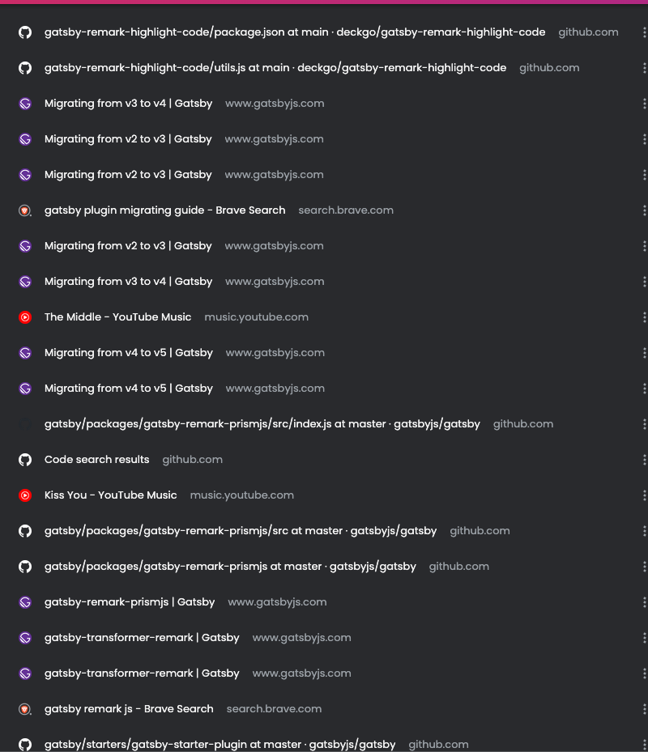
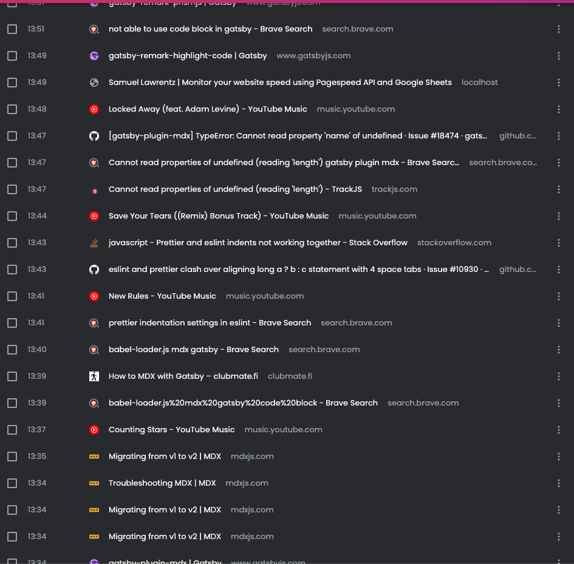

Hey there, folks! I'm back, and it's like I've been resurrected from the technological grave! You might have noticed my absence for a while. Well, let me tell you, it's been a rollercoaster ride in the realm of ones and zeros. I was juggling work and attempting to resuscitate my website, which seemed deader than a doornail in the ever-evolving world of tech. I donned my digital knight armor and embarked on a quest to save it from oblivion. Strap in and let's dive into this epic saga of revival.

## The Techocalypse

Picture this: One fateful day, out of nowhere, my trusty local setup for the website decided to throw in the towel. I was still rocking Gatsby v2 when Gatsby v3, 4, and 5 were partying. Meanwhile, Node.js had a whole coming-of-age journey, skyrocketing to v18 and 19, and npm decided to take the fast track to v7. My website's tech stack was stuck in a time warp, with Gatsby v2, Node v12, and npm v6.

I was on the brink of a tech-nervous breakdown. Every build attempt greeted me with an error message that seemed to have its own cryptic language. I tried to wrangle it into submission, but it was like trying to teach a squirrel to ride a unicycle – frustrating and futile. My work was piling up, and I thought, "I'll fix it later." Little did I know, that "later" would become a never-ending saga.

### My Search Odyssey

If you peeked into my search history, you'd find the same error message searched more times than I've had cups of coffee. I was on the brink of losing my sanity, but a tiny spark of determination kept me going. I couldn't just abandon my website to the digital abyss; it had to rise from the ashes like a phoenix.

##### Here are few snapshots of my search history:
I was listening to music at the same time so you can see quite of music related history as well. One cannot live without music, right?

#### The Day of Redemption

- **10 AM:** Armed with an energetic breakfast, I prepared for battle, putting on my headphones with some music.
- **11 AM:** With a steaming cup of hot coffee, I plunged headfirst into the abyss of errors.
- **12 PM:** Still battling, coffee mugs piling up like trophies, missing dependencies were eating my brain.
- **1 PM:** The struggle continued, my caffeine intake matching my code edits.
- **2 PM:** I threw in the Hail Mary – executed `npx taze` to update all dependencies to the latest and greatest.
- **3 PM:** Took a breather for some grub, desperately needed to refuel my brain.
- **4 PM:** Signs of life! My website was twitching like Frankenstein's monster.
- **5 PM:** The pieces started falling into place, and most issues were history.
- **6 PM:** CI/CD systems were tamed, and I was starting to feel like a tech wizard.
- **7 PM:** Here I am, putting the finishing touches on this blog post. Victory!

## How I Pulled It Off

So, how did I manage to resurrect my digital brainchild? Well, it was a mix of lightning-fast typing and relentless Google searches. Here's a pro tip for you – read those error messages carefully, and search like a tech detective on a caffeine high. It only took me 8 hours of furious typing, endless coffee sips, and unwavering determination to get the job done.

And there you have it, folks! My epic quest to revive my website, filled with technological perils and caffeine-fueled battles. Remember, in the world of tech, even the darkest errors can be conquered with the right mix of persistence and humor. Stay coding, my friends!

Pushing this blog out by 7 PM, I'm feeling like Hackerman. Victory! 🎉