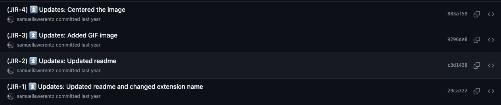
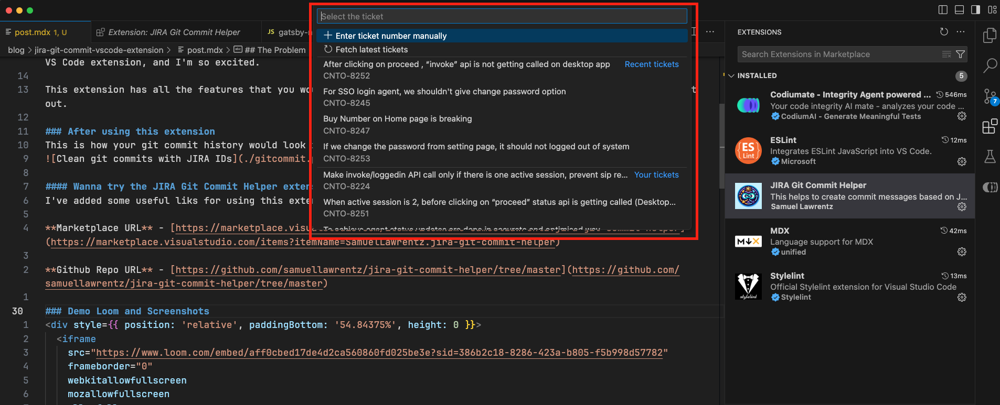

- Are you wondering how to streamline your Git commit messages?
- Do you want to have a consitent git commit template with JIRA IDs included?
- Do you want to get the JIRA details right in the IDE so that you can add proper commit messages with ticket IDs? 
- Do you feel your productivity goes on a toss every time you go to the browser just to search the ticket ID that you are working on?

I've got you covered. I created this VSCode extension two years back and was using it personally, and did not promote it or publish it anywhere. Now I have published it, and it will surely help the developer community. This is my first VS Code extension, and I'm so excited.

This extension has all the features that you would require to add consistency in all your commit messages. Check it out.

### After using this extension
This is how your git commit history would look if you started using this extension.


#### Wanna try the JIRA Git Commit extension?
I've added some useful liks for using this extension. Do check it out.

- **Marketplace URL** - [https://marketplace.visualstudio.com/items?itemName=SamuelLawrentz.jira-git-commit-helper](https://marketplace.visualstudio.com/items?itemName=SamuelLawrentz.jira-git-commit-helper)
- **Github Repo URL** - [https://github.com/samuellawrentz/jira-git-commit-helper/tree/master](https://github.com/samuellawrentz/jira-git-commit-helper/tree/master)

### Demo Loom and Screenshots
<div style={{ position: 'relative', paddingBottom: '54.84375%', height: 0 }}>
  <iframe
    src="https://www.loom.com/embed/aff0cbed17de4d2ca560860fd025be3e?sid=386b2c18-8286-423a-b805-f5b998d57782"
    frameborder="0"
    webkitallowfullscreen
    mozallowfullscreen
    allowfullscreen
    style={{ position: 'absolute', top: 0, left: 0, width: '100%', height: '100%' }}
  ></iframe>
</div>

<div style={{ marginTop: '2.5rem'}}></div>


<div style={{ textAlign: 'center'}}>Listing of JIRAs by the extension</div>


## The Problem
The above video would have covered the whole functionality of the extension. You can still continue reading and get some insights. Okay, moving on, I've summarized my problematic workflow below.
- Every time I want to commit, I have to remember the ticket ID that I'm working on.
- Open the browser, go to JIRA, then search for the ticket.
- Then copy the ID and use it in my commit message.
- Format the commit message with brackets () and proper template

These steps were a blocker to my productivity and breaking my flow state.

## Philosophy
- Never leave your IDE for anything until the task is complete.
- Get the ticket details to IDE and make life easier.
- Streamline Git messages by segregating them into types:
  - 🐞 Bug Fix
  - ⏫ Updates
  - 🔧 Optimization
  - 🧹 Clean up
  - 📋 Chore
  - ⚪ Temp
  - 📒 Documentation
  - 🔂 Revert

This way, the commits are streamlined.

## Solution
VS Code is the primary editor for most devs out there. I wanted to make this experience seamless. I'll show you how this extension was built.

- The idea was to fetch the tickets assigned to you and list them as a quick-pick menu, from where you can select a ticket.
- Then you will be provided with a list of options that specify the type of git commit.
- Also, provide an option to manually enter the ticket ID in case the ticket is not listed in the quick-pick menu.

##### There are a few things that are required for this to work:
- JIRA API
- JIRA Token
- JIRA Username
- JIRA JQL Query to fetch the tickets
- A cache that will store tickets and reduce API Calls

#### JIRA API
The REST API powers this extension. The URL begins something like `https://your-org.atlassian.net/rest/api/3/search`. This will enable us to fetch tickets from our organization's JIRA cloud.
##### Authentication
JIRA uses basic Authentication through an access token. The username is your email address, and the password is the access token.

#### JIRA Token
You can create a token from [this page](https://id.atlassian.com/manage-profile/security/api-tokens) or read this [doc](https://support.atlassian.com/atlassian-account/docs/manage-api-tokens-for-your-atlassian-account/). This token is required to access the resources. This token is shown only once, so keep it safely.

#### JIRA Username
This is just your email that you use to log in. This serves as the username part of the Basic Auth. It should resemble samuel.lawrence@plivo.com.

#### JQL Query
We are only going to show the last 15 tickets assigned to the current user. Older tickets might not be relevant. The JQL query that we use is this:

```javascript
jql=updated >= -20d AND project = CNTO AND assignee in (currentUser()) order by updated DESC&maxResults=15
```

#### The Cache
Yes, hitting the API every time you summon the extension is not good. Graciously, VS Code provides a cache by default from its APIs. I've used it to store the tickets for 30 minutes, after which the API would be called again to fetch the fresh tickets.

Sample usage of the cache API _(actual code from the extension)_:

```javascript
let issuesCache = new Cache(context);
// Store Jira tickets in cache and set expiration to 30 mins in seconds
await issuesCache.put(CONSTANTS.storageKeys.tickets, jiraTickets, 1800);
```

### Recommended Workflow
Before executing this workflow, bind the command `JIRA Commit Helper: Create commit message` command to a key chord like Cmd + G, Cmd + M _(Git + Message)_.
After this, committing becomes very easy.
- You stage all the required files.
- Press Cmd + G, Cmd + C.
- Select the JIRA ID from the populated list.
- Select the commit type.
- Type a short commit message.
- Commit.

Life becomes much simpler.

Surely give this extension a try. It will simplify your workflow and streamline your commits. Suggest this to your team, and if everybody starts using this, the commit messages will look so elegant, so beautiful, just looking like a wowww.

### Recommending the extension to your team
You can add this to workspace recommendations in your source code and it will be recommended for all the members of your team.
```json
// .vscode/extensions.json
{
  "recommendations": [
      "samuellawrentz.jira-git-commit-helper"
  ]
}
```

Do give a [5-star rating](https://marketplace.visualstudio.com/items?itemName=SamuelLawrentz.jira-git-commit-helper&ssr=false#review-details) for the extension. Submit issues or leave feedback if any. Thanks much. Do share. Also feel free to explore this site.

Peace out!

