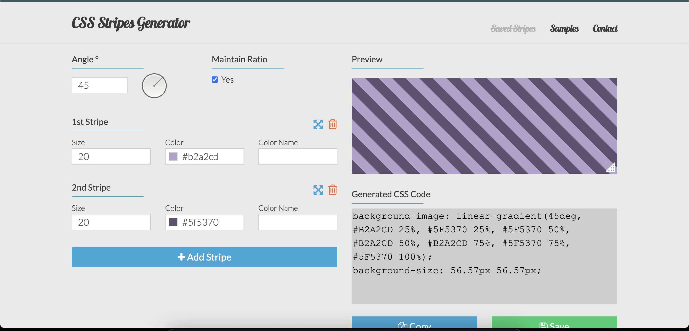
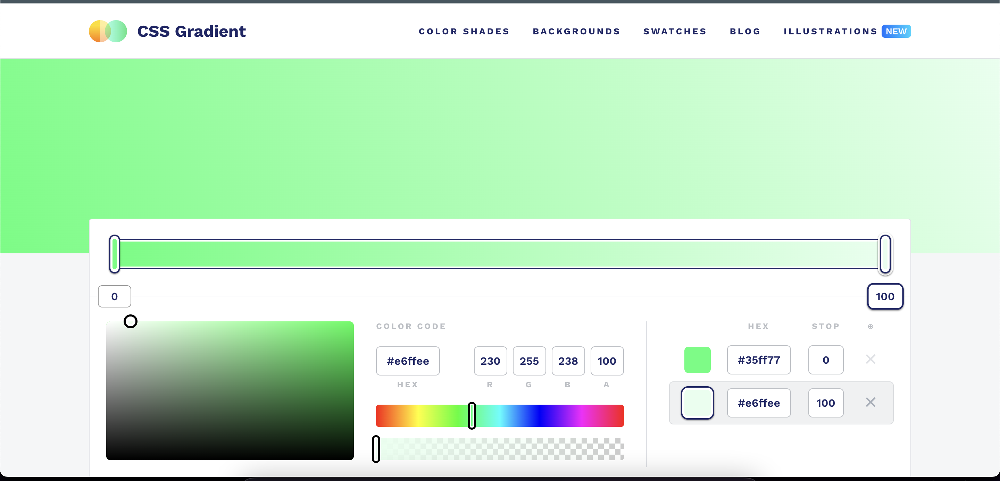
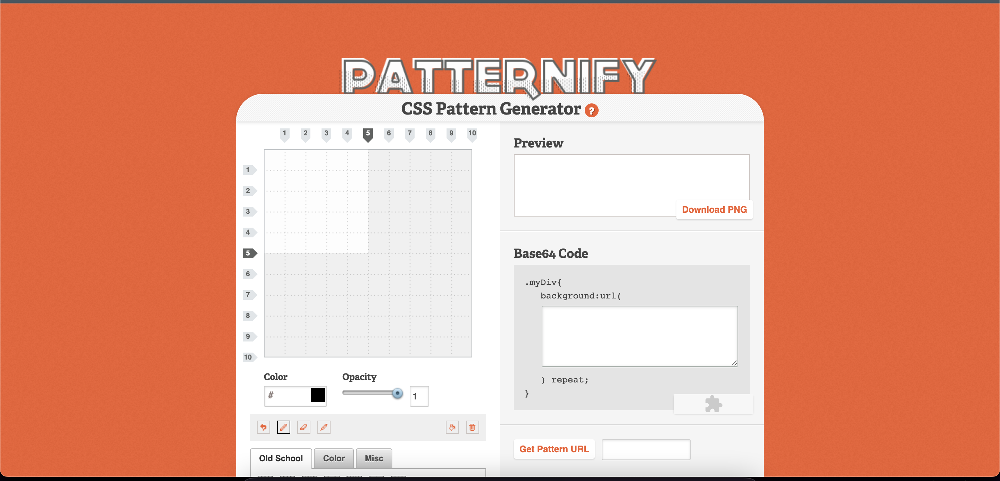
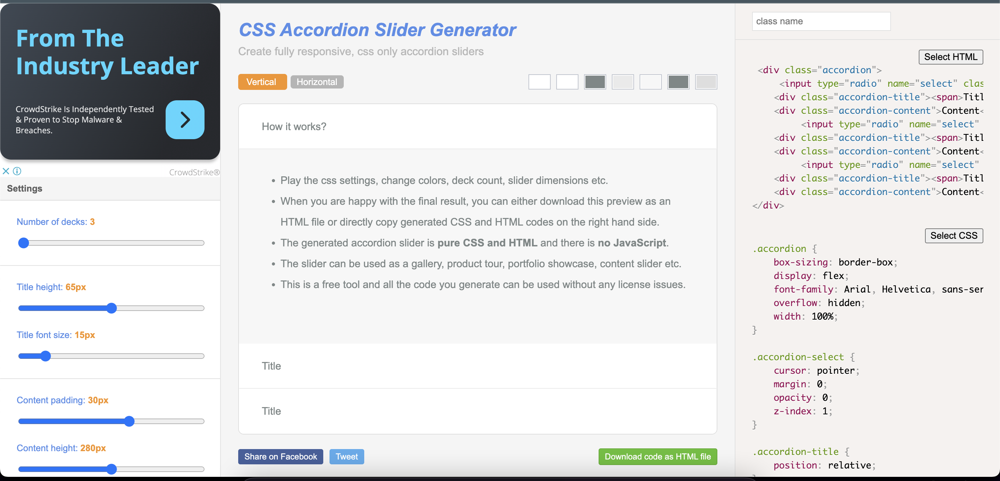
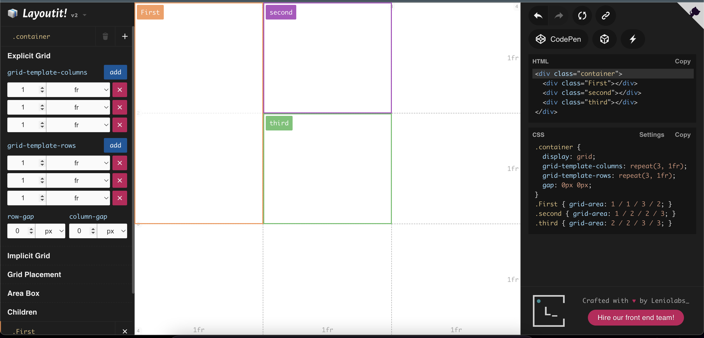

CSS has evolved greatly in recent years. A lot of things can be done using CSS alone. This not only improves performance it also makes the life of the developer easier instead of writing a lot of Javascript code. Also, a great variety of things can be done with CSS. For more insights into advanced coding, you can also check out this [blog about coding standards](https://samuellawrentz.com/blog/coding-standards-husky-typescript-lint-staged).

I have gathered a list of CSS generators from various sources which could be helpful. Let me know in the comments if you’ve used any of these tools or if you've tried any other cool [coding hacks](https://samuellawrentz.com/hacks/react/how-to-use-computed-state-in-react). Okay, let's go!

## 1. Stripes Generator
    
You can generate any kind of stripe background using this generator. This might come in handy when you have some complex stripe to be created just like creating [dynamic JSX elements](https://samuellawrentz.com/hacks/react/mapping-arrays-to-jsx-elements).

[https://stripesgenerator.com/](https://stripesgenerator.com/)

## 2. Gradient Generator
    
Do you have some cool gradient mix in mind? And you want to convert it to CSS code. This tool will help you. Also, you can check out this [guide on handling form inputs](https://samuellawrentz.com/hacks/react/handling-form-inputs-usestate) if you plan to implement a form on your website.

[https://cssgradient.io/](https://cssgradient.io/)

## 3. Pattern Generator
    
This tool generates a pattern and provides you with the base64 code for it. You can even add a different color for each box you select. Try it now. If you're also interested in handling array state updates, this [guide](https://samuellawrentz.com/hacks/react/handling-array-state-updates-immutably) might be helpful.

[http://www.patternify.com/](http://www.patternify.com/)

## 4.  Accordion/Collapse generator
    
If you are a web dev surely you would have come across creating an accordion. We would have searched some UI library or some snippet that we had to modify based on our needs. That job is tedious and hence this tool exists. For more development tips, this [blog about Jira git commit workflow](https://samuellawrentz.com/blog/jira-git-commit-workflow-vscode-extension/) might be of interest.

Create accordions just by moving some sliders. - [https://accordionslider.com/](https://accordionslider.com/)

## 5. Layout Generator
    
I’m sure you would have spent a good amount of time trying to laying out things properly. And even if we did, we would forget the responsive aspect of the layout. This tool helps you create layouts with ease. You might also find this [guide on React's useContext hook](https://samuellawrentz.com/hacks/react/state-management-using-usecontext) useful for managing state in your layout.

[https://grid.layoutit.com/](https://grid.layoutit.com/)

## 6. Animations and CSS helper tools
    
This tool helps you create animations based on steps. You just have to define how the element should look at each step and it generates the heavy CSS for you. They also have some additional cool tools to generate shadows and colors. If you're into React, this [blog on useEffect hook](https://samuellawrentz.com/hacks/react/handling-side-effects-with-useeffect) might be of interest.

[https://keyframes.app/animate](https://keyframes.app/animate)

That's it for today. See you in the next post! For more insights on React, check out this [guide on error handling with error boundaries](https://samuellawrentz.com/hacks/react/error-handling-with-error-boundaries).