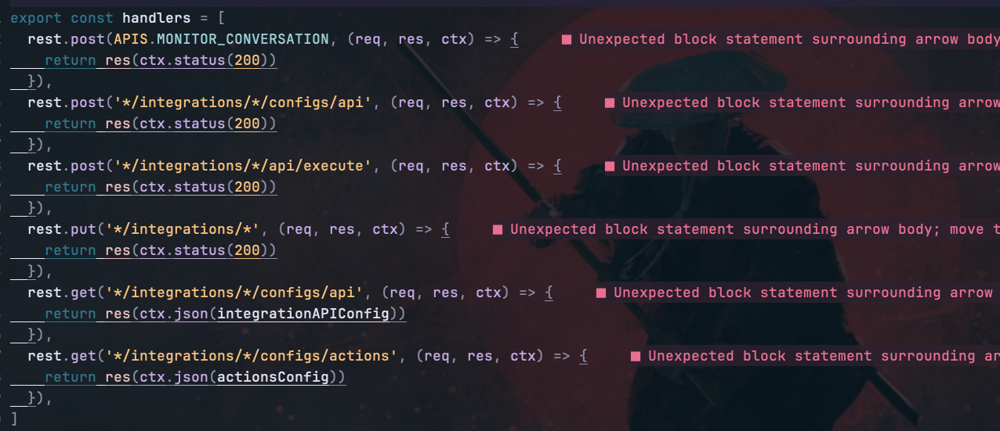

Programming with Neovim can be rewarding but persistent linting errors and warnings from the ESLint Language Server Protocol (LSP) server can cause the experience to be less enjoyable. We understand this and have a useful hack to ameliorate this issue. 



The ESLint LSP server is a fantastic tool for identifying potential bugs and syntax errors while ensuring code quality. However, the bombardment of warnings marking every tiny deviation from the rules can be more of a disturbance than a help, disrupting your focus and stealing valuable code time.

We present a simple, nuanced solution – a way to toggle these warnings on and off at will, putting you in the driving seat of your Neovim experience. Let's walk you through the implementation using Lua programming language:

```lua
-- Disable ESLint LSP server and hide virtual text in Neovim
-- Add this to your init.lua or init.vim file
local isLspDiagnosticsVisible = true
vim.keymap.set("n", "<leader>lx", function()
    isLspDiagnosticsVisible = not isLspDiagnosticsVisible
    vim.diagnostic.config({
        virtual_text = isLspDiagnosticsVisible,
        underline = isLspDiagnosticsVisible
    }) end)
```


In this script, we created a local variable `isLspDiagnosticsVisible` to keep track of the visibility of LSP diagnostics. With the straightforward command `<leader>lx` in Neovim, you can switch the visibility of the ESLint LSP server's underlined warning text and virtual text on and off. 

This hack allows you to continue to harness the power of the ESLint LSP server without the annoyance of continuously highlighted errors. You can decide when you want to view these diagnostics, providing a cleaner workspace, and fostering a less stressful coding environment. 

So go ahead, increase your productivity by customizing your Neovim experience with this meaningful hack.

## References
1. [Neovim](https://neovim.io/)
2. [ESLint](https://eslint.org/)
3. [Language Server Protocol](https://microsoft.github.io/language-server-protocol/)
4. [This discussion on Neovim forums](https://neovim.discourse.group/t/disable-inline-diagnostics/1263)
