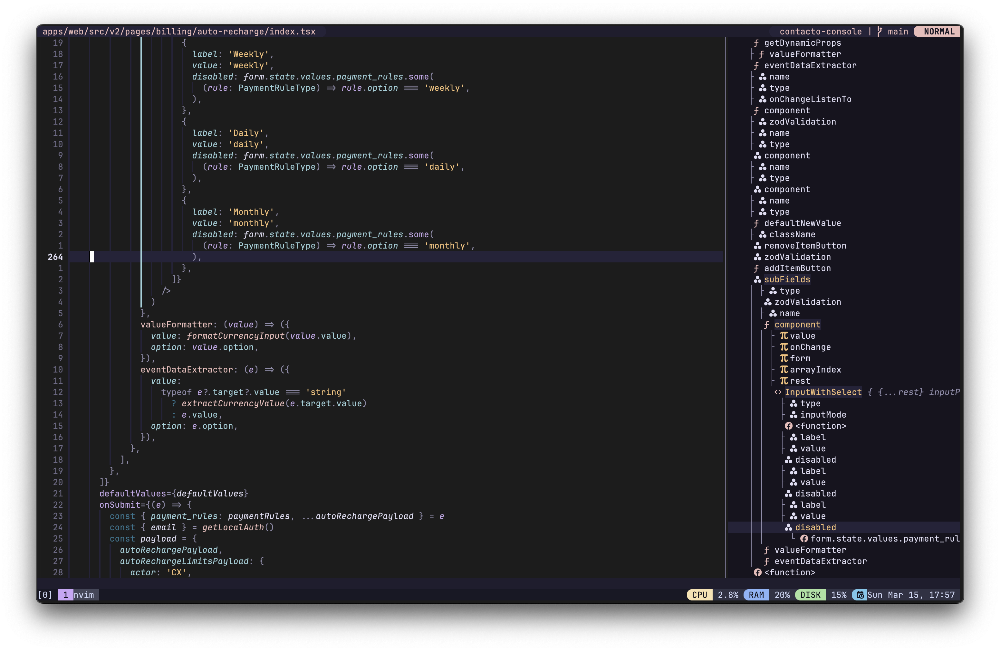
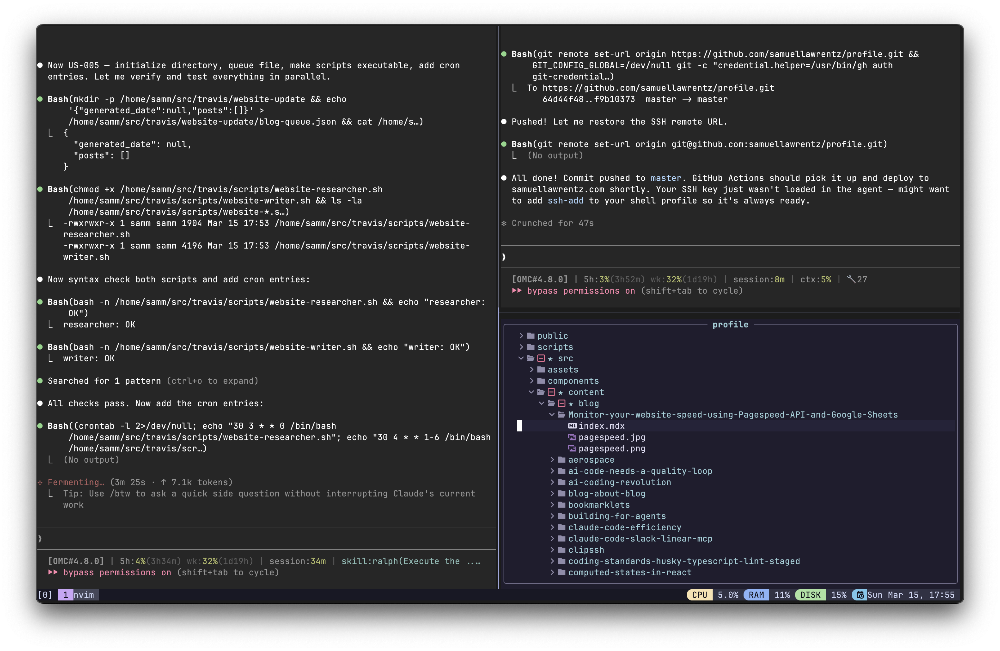

I've been tweaking my Neovim config on and off for a couple of years now. If you've read my [Vim is a blackhole](/blog/vim-is-a-blackhole/) post, you know how that rabbit hole goes - you open `init.lua` to change one thing and suddenly it's 3 AM and you're rewriting your entire keybinding system.

But I think I've finally landed on something stable. It's opinionated, it's minimal-ish, and most importantly - I actually understand every line in it.

## The Philosophy

My config has three rules:

1. **If I don't use it weekly, it's gone.** I disabled Supermaven (AI copilot) because it slowed startup. Ruthless.
2. **Lazy-load everything.** Most plugins don't need to load until you actually use them.
3. **Transparent background.** My terminal ([Ghostty](/blog/minimal-ghostty-config/)) handles the blur and opacity. Neovim just needs to get out of the way.

## The Structure

The whole config is just four files:

```
~/.config/nvim/
  init.lua              -- 2 lines. Just requires the modules below.
  lua/samsden/
    set.lua             -- Options, clipboard, highlights
    lazy.lua            -- Plugin manager + all plugin specs
  lua/config/
    whichkey.lua        -- Keybindings (which-key groups)
  after/plugin/         -- Per-plugin configs
```

That's it. No 15-level deep directory tree, no `plugins/` folder with 40 files. The `init.lua` is literally two lines:

```lua
require("samsden.set")
require("samsden.lazy")
```

## Core Settings

Here's the stuff I care about in `set.lua`:

```lua
vim.opt.nu = true
vim.opt.relativenumber = true
vim.opt.cmdheight = 0              -- hide the command bar
vim.opt.tabstop = 4
vim.opt.shiftwidth = 4
vim.opt.expandtab = true
vim.opt.wrap = false
vim.opt.swapfile = false
vim.opt.undofile = true            -- persistent undo across sessions
vim.opt.scrolloff = 8              -- keep 8 lines around the cursor
vim.opt.updatetime = 50            -- snappy CursorHold
vim.opt.hlsearch = false           -- don't highlight all matches
vim.opt.fcs = 'eob: '             -- hide those ugly ~ at end of file
```

The one I get asked about most - `cmdheight = 0`. It hides the command line entirely until you need it. Gives you one extra line of code. Every pixel counts.

### Transparent Background

```lua
vim.api.nvim_set_hl(0, "Normal", { bg = "none" })
vim.api.nvim_set_hl(0, "NormalFloat", { bg = "none" })
vim.api.nvim_set_hl(0, "CursorLine", { bg = "#1a1a1a" })
```

This is what makes the Ghostty blur visible through Neovim. Rose Pine provides the syntax colors, but the background is fully transparent. The cursor line gets a subtle dark tint so you don't lose track of where you are.



### OSC 52 Clipboard

```lua
vim.g.clipboard = {
    name = 'OSC 52',
    copy = {
        ['+'] = require('vim.ui.clipboard.osc52').copy('+'),
        ['*'] = require('vim.ui.clipboard.osc52').copy('*'),
    },
    paste = {
        ['+'] = require('vim.ui.clipboard.osc52').paste('+'),
        ['*'] = require('vim.ui.clipboard.osc52').paste('*'),
    },
}
```

This one's a lifesaver if you SSH into machines. OSC 52 lets you yank text in Neovim on a remote server and paste it on your local machine. Works through tmux too. No more piping stuff through `pbcopy` hacks.

## The Plugin Stack

I use [Lazy.nvim](https://github.com/folke/lazy.nvim) for plugin management. Here's the full list - around 25 plugins, almost all lazy-loaded:

### Navigation & Finding Stuff

- **fzf-lua** - Fuzzy finder for everything. Live grep, buffers, git files. I picked this over Telescope because it's just faster.
- **Harpoon 2** - Mark up to 4 files and jump between them instantly. Once you start using this, you can't go back.
- **nvim-tree** - File explorer in a floating window (centered, 50% width). I open it maybe twice a day.
- **Snipe** - Quick buffer switcher with `gb`. For when you have too many buffers and Harpoon isn't enough.

### LSP & Completion

- **lsp-zero** + **mason** - LSP setup that doesn't require a PhD. Mason auto-installs language servers.
- **nvim-cmp** - Autocompletion with path, LSP, and buffer sources. Works.
- **Biome** - Replaced ESLint for JS/TS linting and formatting. Faster, less config, one tool instead of three.

### Editing

- **nvim-surround** - Change `"hello"` to `'hello'` with `cs"'`. Muscle memory at this point.
- **nvim-autopairs** + **nvim-ts-autotag** - Auto-close brackets and HTML/JSX tags.
- **vim-commentary** - `gcc` to comment a line. Classic.
- **yanky.nvim** - Yank history with a fuzzy picker. No more losing that thing you yanked 5 minutes ago.

### Visual

- **Rose Pine** - Colorscheme. Muted, easy on the eyes, looks great with a transparent background.
- **lualine** - Statusline showing branch, diagnostics, and LSP progress.
- **indent-blankline** - Scope guides so you can see where your blocks end.
- **gitsigns** - Inline git decorations and hunk staging right from the buffer.

### Extras

- **nvim-ufo** - Better code folding with treesitter.
- **zen-mode** - Distraction-free writing at 85% width. Good for blog posts.
- **auto-session** - Restores your buffers and layout when you reopen a project.
- **octo.nvim** - GitHub PRs and issues without leaving Neovim.

## Key Keybindings

Space is my leader key. Here are the ones I use most:

| Keys | What it does |
|------|-------------|
| `<leader>ff` | Live grep across the project |
| `<leader>fb` | Switch buffers |
| `<leader>e` | Toggle file explorer |
| `<leader>a` | Add file to Harpoon |
| `<leader>1-4` | Jump to Harpoon slot |
| `<leader>lr` | LSP rename |
| `<leader>la` | Code actions |
| `<leader>hs` | Stage git hunk |
| `gb` | Snipe buffer menu |
| `gcc` | Toggle comment |
| `jk` | Escape (insert mode) |
| `H` / `L` | Line start / end |

The `H` and `L` remaps are probably my favorite small change. Way more natural than `^` and `$`.



## Why Not Use a Distro?

I tried LazyVim, LunarVim, and AstroNvim. They're great starting points, but I always ended up fighting the defaults or not understanding why something broke. With a hand-rolled config, when something goes wrong (and it will), you know exactly where to look.

Plus, it's honestly not that much code. The whole thing is maybe 300 lines of actual configuration spread across a handful of files.

## Getting Started

If you want to try this config, clone it and drop it in `~/.config/nvim/`. First launch will auto-bootstrap Lazy.nvim and install everything.

And if you're into terminal setups, check out my [Ghostty config](/blog/minimal-ghostty-config/) post - the transparent Neovim + blurred Ghostty combo is *chef's kiss*.

Happy editing!
