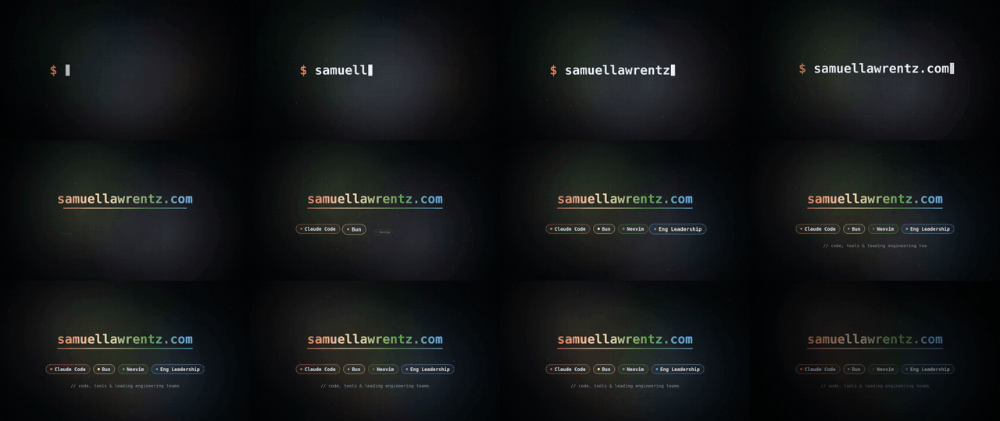
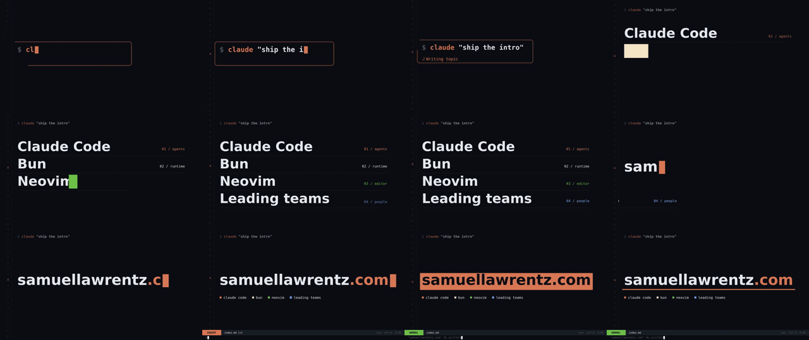

My timeline since Opus 5.5 shipped is half showreels. Launch videos, kinetic type, little product films, all rendered from code, all captioned "one prompt". Then you look at the replies and the prompt was 9,000 characters with a folder of skills.

The one idea from all of this that I actually wanted to test: **make the model look at its own frames.** A code-generated video is a program, and the model can't see what that program draws unless you make it look. So I ran the same brief twice.

## The setup

Same brief both times, Opus 5.5 via `claude -p`, nothing installed. The frames are drawn with `node-canvas` (this blog already uses it for [OG images](/blog/gatsby-dynamic-og-images/)) and encoded with ffmpeg:

> Make a 6-second, 1280x720, 30fps motion graphic intro for my dev blog. It's about Claude Code, Bun, Neovim and leading an engineering team. Dark background. Draw every frame with node-canvas as a pure function of time t, encode with ffmpeg.

Run B got one extra paragraph tacked on:

```
Before you tell me it's done: render it, then build a contact sheet
(ffmpeg -i out.mp4 -vf fps=2,scale=320:-1,tile=4x3 sheet.png),
Read sheet.png and look at it. Critique it honestly: centered text
on a gradient, everything just fading in, dead frames, clipped text,
weak hierarchy, an ending that doesn't land. Fix it and re-render.
At least 2 rounds.
```

A contact sheet is nothing but 12 frames on one image, two per second. The model can read an image in one call, so it sees the whole six seconds at once.

## One-shot



$0.32, 102 seconds, 10 turns. And honestly? It's fine. A terminal prompt types the domain, it turns into a gradient title, four pills pop in, a tagline types, it fades out. Clean, no bugs. It's also exactly the video everyone on the timeline is making fun of: centered text on a dark glow, things appearing one after another. It even checked two single frames on its own, found nothing wrong, and shipped.

## With the critique loop



$1.02, 279 seconds, 34 turns. Now it has an idea: a Claude Code input box types `claude "ship the intro"`, the topics wipe in as big editor lines with a vim cursorline stepping through them, then the name types in, a Neovim statusline rises, `:wq` runs, and the mode flips from INSERT to NORMAL with `"samuellawrentz.com" 4L written`. I laughed at that last bit.

The part that sold me was the critique log it wrote. Round one, it noticed the command line was drawn at y≈726 on a 720px canvas, so `:wq` **was never on screen**. No test would catch that and the code looks correct. You only find it by looking. Round two, it noticed the topic words were bigger than the name, so the hierarchy was upside down. Round three was small fixes like line numbers showing through the status bar.

<aside class="banner banner-info">
It also listed what was still weak without being asked: the last 0.4s barely moves, and the fonts are generic DejaVu. That's the list I'd have written after watching it.
</aside>

## Was it the loop or the checklist?

Being fair to run A, my critique paragraph did two things at once. It made the model look at its frames, and it handed over a list of clichés to avoid. I can't separate those with two runs. My guess is you need both. A model that looks without knowing what "bad" means will say "looks great", like run A did with its two frames. A checklist with no looking catches nothing, like the off-screen `:wq`.

Three times the cost for something I'd actually use as an intro is a trade I'll take. The same trick works anywhere the output is visual: charts, UI, OG images, slides. Render it, tile it, make the model read it.

*If the model can't see it, it didn't check it.*
